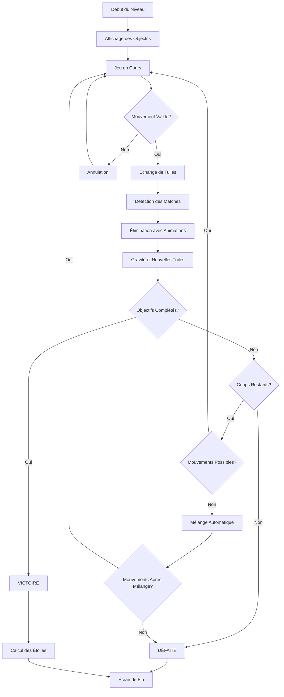

# 🎮 Guide de la Logique du Jeu Mind Bloom

## 📋 **Vue d'ensemble**

**Mind Bloom** est un jeu de puzzle match-3 avec des objectifs spécifiques à chaque niveau. Le but est de compléter tous les objectifs du niveau dans le nombre de coups alloué.

---

## 🎯 **Comment GAGNER un niveau**

### ✅ **Condition de Victoire**
Un niveau est **GAGNÉ** lorsque **TOUS** les objectifs sont complétés, peu importe le nombre de coups restants.

### 📊 **Types d'Objectifs**
1. **Collecter des tuiles** : Éliminer un certain nombre de tuiles d'un type spécifique
2. **Détruire des bloqueurs** : Éliminer les obstacles sur le plateau
3. **Atteindre un score** : Accumuler un certain nombre de points
4. **Libérer des créatures** : Éliminer les tuiles qui emprisonnent des créatures
5. **Nettoyer la gelée** : Éliminer les tuiles recouvertes de gelée

### 🌟 **Système d'Étoiles**
Les étoiles sont calculées selon une formule équilibrée :
- **50%** : Progression des objectifs
- **30%** : Performance du score
- **20%** : Efficacité des coups

**Seuils d'étoiles :**
- ⭐ **1 étoile** : 50% de performance globale
- ⭐⭐ **2 étoiles** : 70% de performance globale  
- ⭐⭐⭐ **3 étoiles** : 90% de performance globale

---

## ❌ **Comment PERDRE un niveau**

### 🚫 **Conditions de Défaite**
Un niveau est **PERDU** dans ces cas :

1. **Plus de coups** : Vous avez utilisé tous vos coups sans compléter les objectifs
2. **Aucun mouvement possible** : Après un mélange automatique, aucun mouvement valide n'est disponible

### 🔄 **Mélange Automatique**
- Si aucun mouvement valide n'est possible, le plateau est automatiquement mélangé
- Si après le mélange, aucun mouvement n'est toujours possible, le niveau est perdu

---

## 🎮 **Mécaniques de Jeu**

### 🔄 **Échange de Tuiles**
- Sélectionnez une tuile, puis une tuile adjacente
- L'échange n'est valide que s'il crée au moins un match de 3 tuiles ou plus
- Chaque échange valide consomme 1 coup

### 🎯 **Détection des Matches**
- **Horizontal** : 3+ tuiles identiques alignées horizontalement
- **Vertical** : 3+ tuiles identiques alignées verticalement
- Les matches de 4+ tuiles donnent des bonus de score

### 📈 **Système de Score**
- **Base** : 100 points par tuile éliminée
- **Bonus 4 tuiles** : +50% de score
- **Bonus 5+ tuiles** : +100% de score
- **Combos** : Multiplicateur de score pour les chaînes d'éliminations

### 🎨 **Animations et Effets**
- **Échange** : Animation de "pop" avec courbes élastiques
- **Élimination** : Rotation et fade-out avec particules
- **Chute** : Gravité réaliste avec courbes d'accélération
- **Apparition** : Effet de bounce pour les nouvelles tuiles

---

## 📊 **Interface Utilisateur**

### 🎯 **Panneau des Objectifs**
- Affichage clair de chaque objectif avec progression
- Barres de progression visuelles
- Indicateurs de complétion (✅)
- Progression globale en pourcentage

### 📈 **Résumé de Performance**
- **Score** : Points actuels vs objectif
- **Efficacité** : Coups utilisés vs coups maximum
- **Objectifs** : Nombre d'objectifs complétés
- **Étoiles** : Étoiles gagnées selon la performance

### 🎮 **Actions Disponibles**
- **Mélanger** : Mélange manuel du plateau
- **Indice** : Suggère un mouvement valide
- **Pause** : Met le jeu en pause avec options

---

## 🔧 **Logique Technique**

### 🏗️ **Architecture**
- **GameProvider** : Gestion de l'état du jeu et de la logique
- **LevelObjective** : Définition des objectifs avec progression
- **Tile** : Représentation des tuiles avec états et animations
- **GameAnimations** : Gestion centralisée des animations

### 🎯 **Vérification des Objectifs**
```dart
bool _isLevelCompleted() {
  for (final objective in _currentObjectives) {
    if (!objective.isCompleted) {
      return false;
    }
  }
  return true;
}
```

### 🌟 **Calcul des Étoiles**
```dart
int getStarsEarned() {
  final objectivesRatio = objectivesCompleted / totalObjectives;
  final scoreRatio = score / targetScore;
  final movesRatio = (maxMoves - movesUsed) / maxMoves;
  
  final globalScore = (objectivesRatio * 0.5) + 
                     (scoreRatio * 0.3) + 
                     (movesRatio * 0.2);
  
  if (globalScore >= 0.9) return 3;
  if (globalScore >= 0.7) return 2;
  if (globalScore >= 0.5) return 1;
  return 0;
}
```

---

## 🎨 **Types de Tuiles**

| Type | Icône | Couleur | Description |
|------|-------|---------|-------------|
| 🌸 **Fleur** | `local_florist` | Rose | Tuile de base |
| 🍃 **Feuille** | `eco` | Vert | Tuile de base |
| 💎 **Cristal** | `diamond` | Bleu | Tuile de base |
| 🌱 **Graine** | `grass` | Marron | Tuile de base |
| 💧 **Rosée** | `water_drop` | Cyan | Tuile de base |
| ☀️ **Soleil** | `wb_sunny` | Jaune | Tuile de base |
| 🌙 **Lune** | `nightlight_round` | Violet | Tuile de base |
| 💎 **Gemme** | `gem` | Turquoise | Tuile de base |

---

## 🚀 **Conseils de Jeu**

### 💡 **Stratégies**
1. **Priorisez les objectifs** : Concentrez-vous sur les objectifs spécifiques
2. **Planifiez vos coups** : Chaque coup compte, réfléchissez avant d'agir
3. **Créez des combos** : Les chaînes d'éliminations donnent plus de points
4. **Utilisez les indices** : En cas de blocage, demandez un indice
5. **Mélangez si nécessaire** : N'hésitez pas à mélanger le plateau

### ⚠️ **Pièges à Éviter**
- Ne pas gaspiller les coups sur des mouvements non stratégiques
- Ne pas ignorer les objectifs secondaires
- Ne pas oublier de vérifier la progression des objectifs

---

## 🔄 **Flux de Jeu**



---

## 📝 **Résumé**

**Mind Bloom** est un jeu de puzzle équilibré où :
- ✅ **Victoire** = Tous les objectifs complétés
- ❌ **Défaite** = Plus de coups OU aucun mouvement possible
- 🌟 **Étoiles** = Performance globale (objectifs + score + efficacité)
- 🎯 **Objectif principal** = Compléter les objectifs spécifiques du niveau

La logique est maintenant **claire et transparente** pour une expérience de jeu optimale ! 🎮✨
